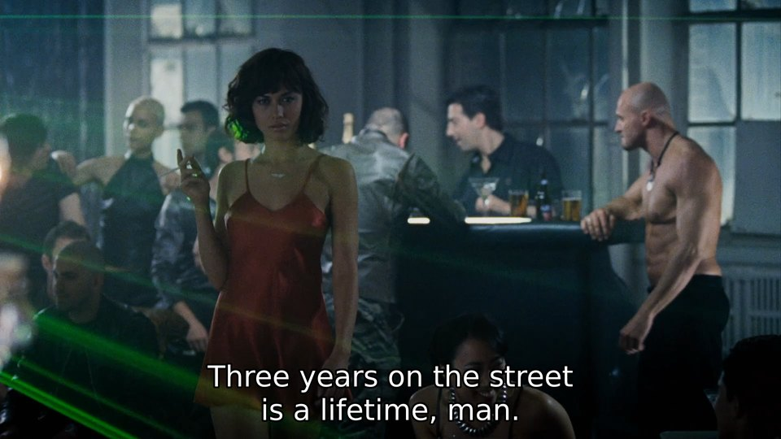

 
    
The Algebra of a Tensor Field

    <a style="font-size: 1.5rem; margin-top: 1.5rem; margin-bottom: 1.5rem;" href="https://aabbtree77.github.io/">Ramūnas Girdziušas</a>
    
Last Update: September 26, 2024

These are my notes about physics, tensor fields, spin. Taken while reading [Shankland (1970)](https://aapt.scitation.org/doi/10.1119/1.1976018).

## Tensor Freedom

A good book on tensors is [Schaum's Tensor Calculus](https://kishorekoduvayur.wordpress.com/wp-content/uploads/2017/12/schaums-tensor-calculus-238.pdf) by David C. Kay. The only problem is that it goes to the analysis prematurely, like all the textbooks on this subject. I will fill in a few details that are generally missing related to tensor index positioning, tensor algebra, group theory. 

One difficulty of life is that tensors and differential geometry are incomplete. We need to bring in spinors and group theory which add a lot of complexity to what is already quite complex. Expect "language within a language" type of problems, and constant fog with questions such as "is this a number or a matrix", "what is the size of x", "is it complex or real".

**Exercise 1.** Show that tensors allow the following index positioning freedom:

$$
X{^i}{^j}{_k} = X{^i}{_k}{^j} = X{_k}{^i}{^j}.
$$

Hint: Define a tensor as a weighted sum of the Kronecker products of the indicator bases such as

$$
\begin{align}
X{^i}{^j}{_k}\equiv \sum_{ijk}\,c_{ijk}\,e^{i}\otimes e^{j}\otimes e_{k}\,,
\end{align}
$$

where $c_{ijk}$ are some constants. Assume that $e^{i}$ is a unit row-vector, and $e_{k}$ is a unit column-vector. Notice [the Kronecker product](https://en.wikipedia.org/wiki/Kronecker_product) $\otimes$ property:

$$
\begin{align}
a^{i}\otimes b^{j} &\neq b^{j}\otimes a^{i}\,,\\
a^{i}\otimes b_{j} &= b_{j}\otimes a^{i}\,.
\end{align}
$$

for any row-vector $a^{i}$ and column-vector $a^{j}$.

## Shankland's Tensor Algebras

An archetypical problem that ChatGPT cannot solve: Given the [four-vector](https://en.wikipedia.org/wiki/Four-vector) $k_{\mu}$ and [the metric tensor](https://en.wikipedia.org/wiki/Metric_tensor) $g_{\mu\nu}$, write down the most general dimensionless tensor ${T_{\mu\nu}}^{\rho \sigma}$ symmetric under the permutations of the covariant indices $(\mu, \nu)$, and also symmetric w.r.t. the permutations of contravariant indices $(\rho, \sigma)$. It should be a sum of linearly independent terms, each with a manifest symmetry, and at most fourth order in $k_{\mu}$.

[Shankland (1970)](https://aapt.scitation.org/doi/10.1119/1.1976018) jumps into the answer, which is a linear combination of

$$
\begin{align}
X_{1} & = \frac{1}{4} {g_{(\mu}}^{(\rho} {g_{\nu)}}^{\sigma)}\,,\\
X_{2} & = g_{\mu \nu} g^{\rho \sigma}\,, \\
X_{3} & = \frac{1}{k^2} g_{\mu \nu} k^{\rho} k^{\sigma}\,, \\
X_{4} & = \frac{1}{k^2} k_{\mu} k_{\nu} g^{\rho \sigma}\,, \\
X_{5} & = \frac{1}{k^4} k_{\mu} k_{\nu} k^{\rho} k^{\sigma}\,, \\
X_{6} & = \frac{1}{k^2} k_{(\mu} {g_{\nu)}}^{(\rho} k^{\sigma)}\,.
\end{align}
$$

Here the division by 4 of the first basis element is not important, but it would turn $X_{1}$ into an index symmetrization operator if one acted with it on any two-index tensor.

**Magically, these tensor basis expressions form an algebra under the product defined as**

$$
A\, B \equiv {A_{\mu \nu}}^{\alpha \beta} {B_{\alpha \beta}}^{\rho \sigma}\,,
$$

with the implied summation over repeated indices.

**Exercise 2.** Show that

$$
X_{6} X_{6} = 8 X_{5} + 2 X_{6},
$$

which is not $8 X_{4} + 2 X_{6}$ stated by [Shankland (1970)](https://aapt.scitation.org/doi/10.1119/1.1976018).

Hint:

The definitions of the product and index symmetrization $(\cdot, \cdot)$ lead to $X_{6} X_{6}$ expressed as

$$
\begin{align}
& \equiv \frac{1}{k^2} k_{(\mu} {g_{\nu)}}^{(\alpha} k^{\beta)} \frac{1}{k^2} k_{(\alpha} {g_{\beta)}}^{(\rho} k^{\sigma)}\\
 &= \frac{1}{k^4} \Big( k_{\mu} {g_{\nu}}^{\alpha} k^{\beta} + k_{\mu} {g_{\nu}}^{\beta} k^{\alpha} \\
            & \;\;\;\;+ k_{\nu} {g_{\mu}}^{\alpha} k^{\beta} + k_{\nu} {g_{\mu}}^{\beta} k^{\alpha} \Big)\\
            & \;\;\;\;\cdot \Big( k_{\alpha} {g_{\beta}}^{\rho} k^{\sigma} + k_{\alpha} {g_{\beta}}^{\sigma} k^{\rho} \\
            & \;\;\;\;+ k_{\beta} {g_{\alpha}}^{\rho} k^{\sigma} + k_{\beta} {g_{\alpha}}^{\sigma} k^{\rho} \Big).
\end{align}
$$

This will produce 16 terms, but they will further simplify with the use of

$$
\begin{align}
k_{\alpha} k^{\alpha} & = k^2 \\
{g_{\nu}}^{\alpha}k_{\alpha} &= k_{\nu} \\
{g_{\nu}}^{\beta} {g_{\beta}}^{\sigma} &= {g_{\nu}}^{\sigma}\;,
\end{align}
$$

e.g.

$$
\begin{align}
t_{1} & = k_{\mu} {g_{\nu}}^{\alpha} k^{\beta} \cdot k_{\alpha} {g_{\beta}}^{\rho} k^{\sigma} \\
& = k_{\mu} \big({g_{\nu}}^{\alpha} k_{\alpha}\big) \big({g_{\beta}}^{\rho} k^{\beta}\big) k^{\sigma} \\
&= k_{\mu} k_{\nu} k^{\rho} k^{\sigma}.
\end{align}
$$

A page later ;) there will be 8 such terms and a doubled $X_{6}$ left. 

## The Spectrum of a Tensor Field

The products $X_{i}X_{j}$ and the traces $X_{i}$ determine the spectrum or the particle content of a tensor field. Shankland does not define a tensor field, but it is assumed that $X_{i}$ will be an operator applied to build a quadratic form for a field, where $k_{i}$ becomes a four-nabla. The PhD thesis of [K.J. Barnes (1963)](https://spiral.imperial.ac.uk/bitstream/10044/1/13413/2/Barnes-KJ-1963-PhD-Thesis.pdf) sheds more light here, but his notation requires getting used to.

The traces are defined as

$$
\begin{align}
\textit{tr}\,{X_{\mu \nu}}^{\rho \sigma}  \equiv {X_{\mu \nu}}^{\mu \nu}\,,
\end{align}
$$

and they demand the knowledge of the metric tensor $g_{ij}$ with the mixed tensor

$$
\begin{align}
{g_{i}}^{j}={\delta_{i}}^{j}=\begin{cases}
0 & i \ne j \\
1 & i = j
\end{cases}\;\;.
\end{align}
$$

There is no need to know these values when getting the product tables $X_{i}X_{j}$. 

[Shankland (1970)](https://aapt.scitation.org/doi/10.1119/1.1976018) applies [the Faddeev - LeVerrier algorithm](https://en.wikipedia.org/wiki/Faddeev%E2%80%93LeVerrier_algorithm), or rather its highly advanced variant extended to tackle multiple eigenvalues, see e.g. [Helmberg and Wagner (1993)](https://core.ac.uk/download/pdf/81192811.pdf). Note also that here we do not have eigenvectors in a traditional sense, they are the weighted sums of the basis of an abstract algebra $X_{i}$, not some columns extracted from $X_{i}$. 

[K.J. Barnes (1963)](https://spiral.imperial.ac.uk/bitstream/10044/1/13413/2/Barnes-KJ-1963-PhD-Thesis.pdf) seeks the spectrum differently, with the matrix projection operators.

Mysteriously, the eigenvalues will have multiplicities which can be deduced independently from the Lorentz group theory (Lorentz with "t"), without any iterations and polynomial equations. The group theory, however, won't get us to the eigenvector equations leading to the Lorenz gauge condition (Lorenz without "t").

**Exercise 3.** Verify Shankland's spectral results, esp. the case with one vector and one spinor index: "... we find, together with their antiparticles, the following groups of particles: a quadruplet, and two doublets."

Hint:

According to group theory, combining indices means taking "tensor products $(m,n)\otimes (k,l)$ of the Lorentz irreps", clf. Weinberg's QFT, Vol. 1, pages 229-233. What is relevant here is that each such an irrep constitutes a set of subspaces with multiplicities $2s+1$ for $s=|m-n|, |m-n+1|\ldots, m+n$.

- $(0,0)$: A scalar. Shankland's singlet: A single subspace with eigenvalue multiplicity $2\cdot 0+1=1$.

- $(\frac{1}{2},\frac{1}{2})$: A single four-vector index. Shankland's singlet and triplet: two subspaces $0, 1$ with their multiplicities $1$ and $3$.

- $(\frac{1}{2},0)\oplus (0,\frac{1}{2})$: A full single spinor index. Shankland's doublet and its antidoublet: $\frac{1}{2},  \frac{1}{2}$ subspaces with multiplicites $2$ and $2$.

- $(1,1)$: Two symmetric tensor indices. A mismatch with Shankland's pentuplet, triplet, and two singlets: Subspaces $0, 1, 2$ with the multiplicities $1$, $3$, and $5$. Where is the missing singlet? In a symmetric two-index tensor case, to remove a singlet also means to make the tensor traceless, so the group theory still matches Shankland under the assumption of **tracelessness**.

- $(1,0)\oplus (0,1)$: Two asymmetric tensor indices. Shankland's two particle triplets: Subspaces $1$ and $1$ with the multiplicities $3$ and $3$.

- $(\frac{1}{2},\frac{1}{2}) \otimes \Big((\frac{1}{2},0)\oplus (0,\frac{1}{2})\Big)$, i.e. combining a vector and a spinor index?

It splits into a vector and $(1,\frac{1}{2}) \oplus (\frac{1}{2},1)$, clf. Weinberg's QFT, Vol. 1, page 232. Thus, we obtain the subspaces $\frac{1}{2}$ and $\frac{3}{2}$ with multiplicities $2$ and $4$, along with the "antisubspace". This is twice fewer doublets than calculated by Shankland. 

## More Tensor Charades

Shankland's construction is one of the most complex calculations that one can build only with the 4-vector $k_{\mu}$ and the metric tensor $g_{\mu\nu}$. Add to this the gamma matrices $\gamma_{\mu}$, and you will be amused how much complexity a human can create in a domain which deals with regular low-dimensional objects in a spherical vacuum. And this complexity is only the beginning ;). 

One can find some other mildly successful uses/hints of tensor algebras in [Phys. Rev. 106, 1345 (1957)](https://journals.aps.org/pr/abstract/10.1103/PhysRev.106.1345); [Nuovo Cimento, 43, 475 (1966)](https://link.springer.com/article/10.1007/BF02752873); [Nuovo Cimento 47, 145 (1967)](https://link.springer.com/article/10.1007/BF02818340); [Phys. Rev. 153, 1652 (1967)](https://journals.aps.org/pr/abstract/10.1103/PhysRev.153.1652); [Phys. Rev. 161, 1631 (1967)](https://journals.aps.org/pr/abstract/10.1103/PhysRev.161.1631); [Phys. Rev. D 8, 2650 (1973)](https://journals.aps.org/prd/abstract/10.1103/PhysRevD.8.2650); [Nuovo Cimento 28, 409 (1975)](https://inspirehep.net/literature/98459); [Phys. Lett. B 301 4 339 (1993)](https://arxiv.org/abs/hep-th/9212008); [Phys. Rev. C 64, 015203 (2001)](https://arxiv.org/abs/hep-ph/0103172); [Phys. Rev. D 64, 125013 (2001)](https://journals.aps.org/prd/abstract/10.1103/PhysRevD.64.125013); [Hadronic J. 26, 351 (2003)](https://www.imath.kiev.ua/~nikitin/PAPER26.pdf); [Phys. Rev. D 67, 085021 (2003)](https://journals.aps.org/prd/abstract/10.1103/PhysRevD.67.085021); [Phys. Rev. D 67, 125011 (2003)](https://journals.aps.org/prd/abstract/10.1103/PhysRevD.67.125011); [Nucl. Phys. B724, 453 (2005)](https://arxiv.org/abs/hep-th/0505255); [Phys. Rev. D 74, 084036 (2006)](https://journals.aps.org/prd/abstract/10.1103/PhysRevD.74.084036); [P. Cvitanović (2008)](https://birdtracks.eu/); [V. Monchiet and G. Bonnet (2010)](https://royalsocietypublishing.org/doi/10.1098/rspa.2010.0149); [Phys. Rev. D 97, 115043 (2018)](https://journals.aps.org/prd/abstract/10.1103/PhysRevD.97.115043); [SUGRA and CDC](https://news.stonybrook.edu/facultystaff/qa-with-breakthrough-prize-winner-peter-van-nieuwenhuizen/)...

It is tough to read this literature, nothing is too interesting there, to be honest. Note that Shankland's paper is hardly known. It is not in Phys Rev spaces, the AAPT community has not dissected it inside out like it would do with anything touching Maxwell.

## Is Shankland's Program Worthy? 

We do not get theorems or new results, only a preliminary space to build stuff. There is no dynamics yet, but this is a world in its own. I am thinking of [Apocalypto (2006)](https://www.imdb.com/title/tt0472043/), esp. its ending which is also the new beginning.

As a concrete example, Shankland shows how removing spin 0 from a vector field leads to apesanteur $A$ aka a vector potential. We can now apply this to gravity by removing spins 0 and 1 from the symmetric tensor field and get some kind of an apesanteur there too. Honestly, I would do this only if someone pressed a gun to my brain.

So a field with tensor/spinor indices and their permutation symmetries in, a Lorentz-invariant operator to build a quadratic form for the field out. With a machinery to engineer (add remove) spin content. Notice that Shankland calls a quadratic form operator "a correlation function" which is probably another hidden use, albeit little explored.

A lot of technical questions are left unanswered. The gauge transforms are barely discussed, if at all. Also when and why do the combinations of the primitives such as $k$, $g$, $\gamma$ would form an algebra? Where do these primitives come from for an arbitrary Lie group/algebra? Have we not missed the Pauli matrix or [$\epsilon$](https://en.wikipedia.org/wiki/Levi-Civita_symbol) here and there? How to complete an algebra, verify the basis dimension? Why does $\gamma_{\mu}p^{\mu}$ have to be treated like an independent quantity when building a vector-spinor basis, effectively doubling the basis dimension from 5 to 10? 

A fundamental problem here is that a desire to have a quadratic form/matrix/correlation doubles all the indices, but this complexity might be avoidable. A worthy contender "engine" would be what one would call the "Lie-Rivlin-Spencer-Zhilin" pipeline, though it is only in my head at the moment. It would be yet another rather long program to build invariant cost functions, by using the same primitives of Shankland, but more frugally, by not relying on the quadratic form operator, going only for the cost function directly. It would be harder to engineer spin content though. 

## How Not to Get Lost in Modern Physics

I wish I knew. The theory revolves around the Lorentz, PCT, and gauge transformations. This does not sound much until you look into Weinberg's three volumes of QFT, and his two volumes of classical gravity.

History and real experiments compress it all naturally. We do not have that many key experiments after 400 years since Galileo. Consider light: Newton, Fresnel-Arago, Hertz, Lebedev, Compton, [Pound–Rebka](https://en.wikipedia.org/wiki/Pound%E2%80%93Rebka_experiment), [Breit–Wheeler](https://en.wikipedia.org/wiki/Breit%E2%80%93Wheeler_process)... Add a dozen more, but the subject will remain manageable.

<a style="font-size: 1.5rem;" href="https://youtu.be/Y183gJQ9yCY?t=20">Sign the contract big boy...</a>

